# Pull Request Tutorial

`Pull Request = PR`

This tutorial is written both for:

* person who create PR, lets call that person **creator** 👩‍💻👨‍💻
* person who reviews PR, lets call that person **reviewer** 📖

All sections are marked according to which role is making this part.

## Table of contents
<!-- toc -->
* [What is a Pull Request? 👩‍💻👨‍💻/📖](#what-is-a-pull-request-%F0%9F%91%A9%E2%80%8D%F0%9F%92%BB%F0%9F%91%A8%E2%80%8D%F0%9F%92%BB%F0%9F%93%96)
* [Creating a Pull Request 👩‍💻👨‍💻](#creating-a-pull-request-%F0%9F%91%A9%E2%80%8D%F0%9F%92%BB%F0%9F%91%A8%E2%80%8D%F0%9F%92%BB)
    + [Creating a Topical Branch](#creating-a-topical-branch)
    + [Creating a Pull Request](#creating-a-pull-request)
* [Updating a Pull Request 👩‍💻👨‍💻](#updating-a-pull-request-%F0%9F%91%A9%E2%80%8D%F0%9F%92%BB%F0%9F%91%A8%E2%80%8D%F0%9F%92%BB)
* [Using a Pull Request 📖](#using-a-pull-request-%F0%9F%93%96)
* [Merging a Pull Request 👩‍💻👨‍💻](#merging-a-pull-request-%F0%9F%91%A9%E2%80%8D%F0%9F%92%BB%F0%9F%91%A8%E2%80%8D%F0%9F%92%BB)
* [Closing a Pull Request 👩‍💻👨‍💻/📖](#closing-a-pull-request-%F0%9F%91%A9%E2%80%8D%F0%9F%92%BB%F0%9F%91%A8%E2%80%8D%F0%9F%92%BB%F0%9F%93%96)
    - [Why?](#why)
    - [How?](#how)
* [More](#more)
<!-- tocstop -->

## What is a Pull Request? 👩‍💻👨‍💻/📖
From Github's [Using Pull Requests Page](https://help.github.com/articles/using-pull-requests)
> Pull requests let you tell others about changes you've pushed to a GitHub repository. Once a pull request is sent, interested parties can review the set of changes, discuss potential modifications, and even push follow-up commits if necessary.

Pull Requests are commonly used by teams and organizations collaborating using the [Shared Repository Model](https://help.github.com/articles/using-pull-requests#article-platform-nav), where everyone shares a single repository and topic branches are used to develop features and isolate changes. Many open source projects on Github use pull requests to manage changes from contributors as they are useful in providing a way to notify project maintainers about changes one has made and in initiating code review and general discussion about a set of changes before being merged into the main branch.

Here's [an example pull request](https://github.com/jquery/jquery/pull/1051) from jQuery's github repo.

---

## Creating a Pull Request 👩‍💻👨‍💻

There are 2 main work flows when dealing with pull requests:

1. Pull Request from a branch within a repository
1. ~~Pull Request from a [forked repository](https://help.github.com/articles/fork-a-repo)~~ (this article is not about this flow)

Here we are going to focus on 1.

### Creating a Topical Branch

First, we will need to create a branch **from the latest commit** on master (or `develop`, depends on git flow you're using). 

Make sure your repository is up to date first using

```bash
git pull origin master
```

*Note:* `git pull` does a `git fetch` followed by a `git merge` to update the local repo with the remote repo. For a more detailed explanation, see [this stackoverflow post](http://stackoverflow.com/questions/292357/whats-the-difference-between-git-pull-and-git-fetch).

To create a branch, use `git checkout -b <new-branch-name> [<base-branch-name>]`, where `base-branch-name` is optional and defaults to `master`. I'm going to create a new branch called `pull-request-demo` from the `master` branch and push it to github.

```bash
git checkout -b pull-request-demo
git push origin pull-request-demo
```

### Creating a Pull Request

To create a pull request, you must have changes committed to your new branch.

Go to the repository page on github. And click on "Pull Request" button in the repo header.

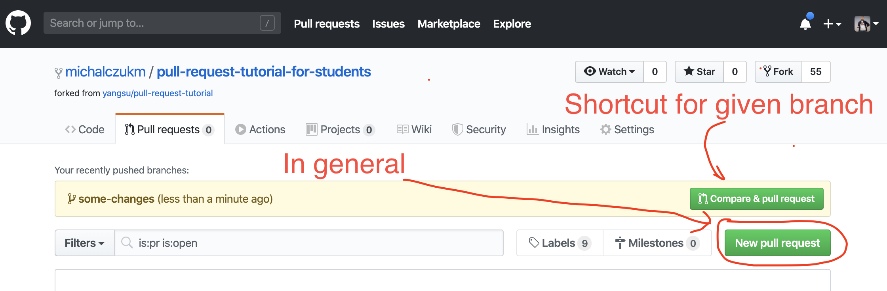

Select branches:

* Select the **base** branch (it is your **target** branch), where you want to merge your changes to.
* Select **compare** branch, your branch which you'd like to merge

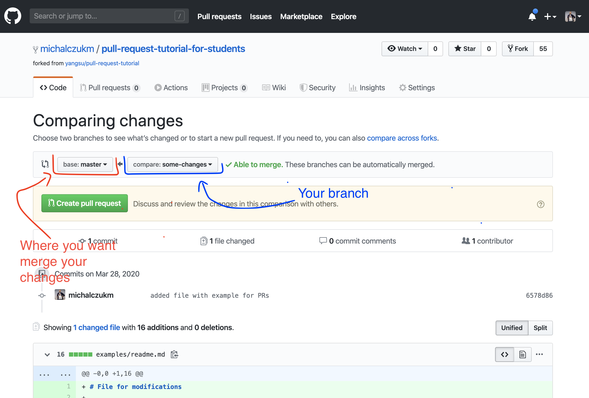

Enter meaningful **title** and **description** for your pull request (other people will be reading this, not machines!).

Remember you can use [Github Flavored Markdown](https://help.github.com/articles/github-flavored-markdown) in the description and comments.

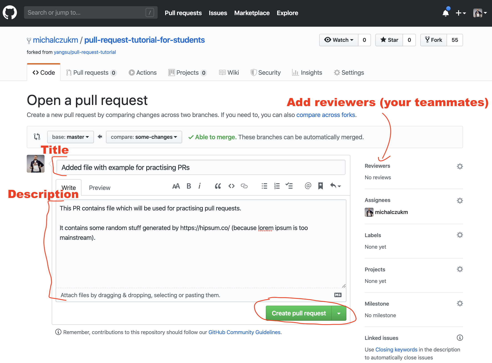

Finally, click on the green "Create pull request" button to finish creating the pull request.

You should now see an open pull request.

Which might be ready for merge (doesn't make sense, without code review :exclamation: No way :exclamation:) - depending on your GitHub repository settings.

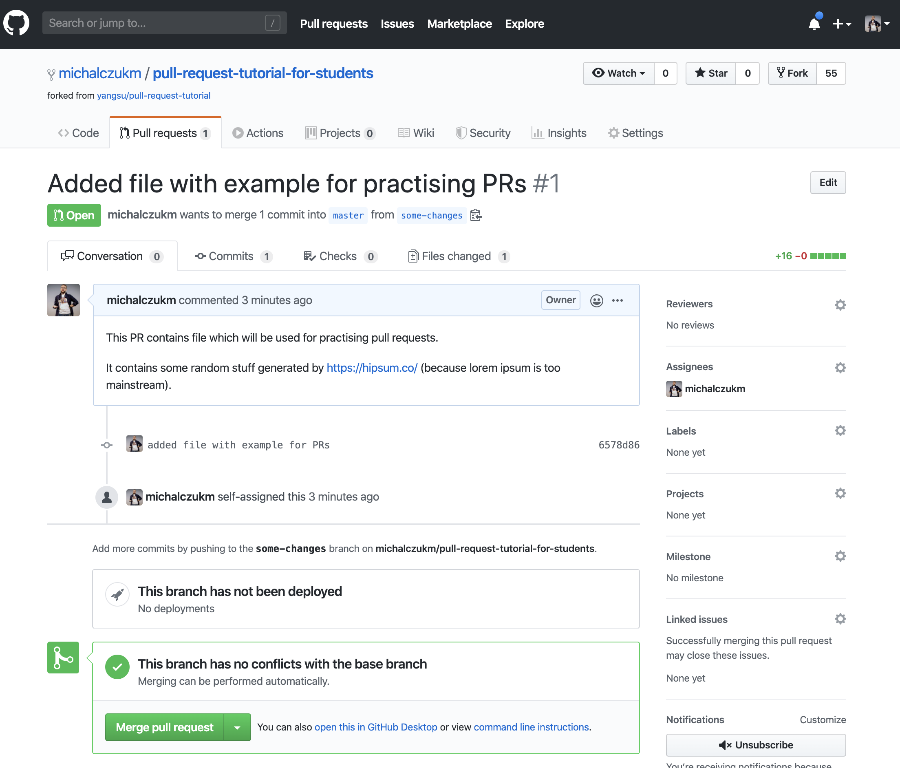

Or with constraints, like `Review reqired` (thats how we do it :blush:)

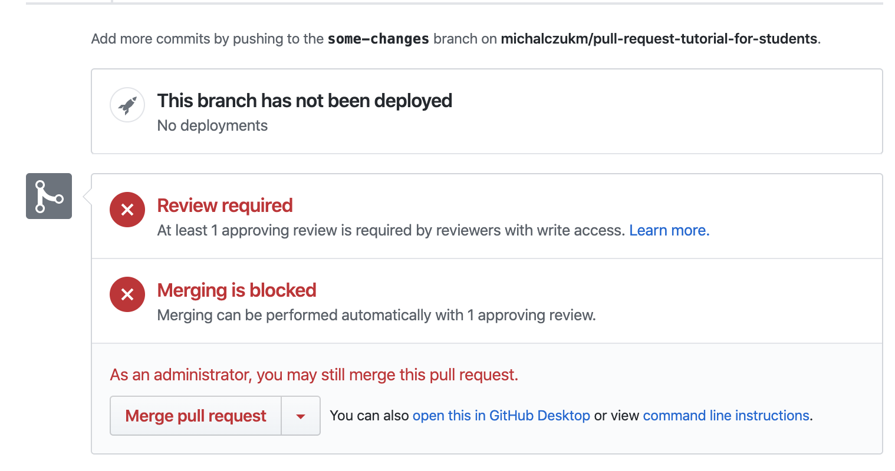

Great :clap:

Now its time for reviewers 📖 to take a look at your PR.
I hope you already added them - to they get notified!

From now on this PR is your platform for communication about this code changes.

**You can:**

* write comments
* answer to other comments
* update PR by adding changes (see👇)

## Updating a Pull Request 👩‍💻👨‍💻

:wave: you, PR creator, yes you :exclamation:

Since pull request is a request to add commit from one stream (branch) to another, the simplest way to update code in your PR is to ... push new commits on your branch.

```bash
# add changes, improvements, make your PR better
...

# then commit it
git commit -m "meaningful message describing your changes"

# and push it
git push origin pull-request-demo
```

## Using a Pull Request 📖

So, you received a PR. What next :question:


* View all the commits by all contained by a pull request under the commits tab,
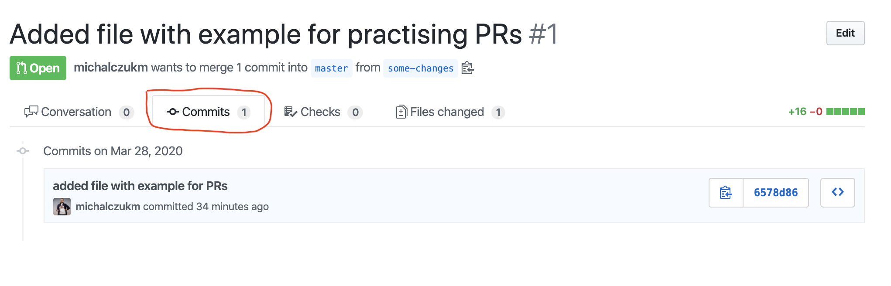
* See all file changed, and make inline comments there (recommended). You
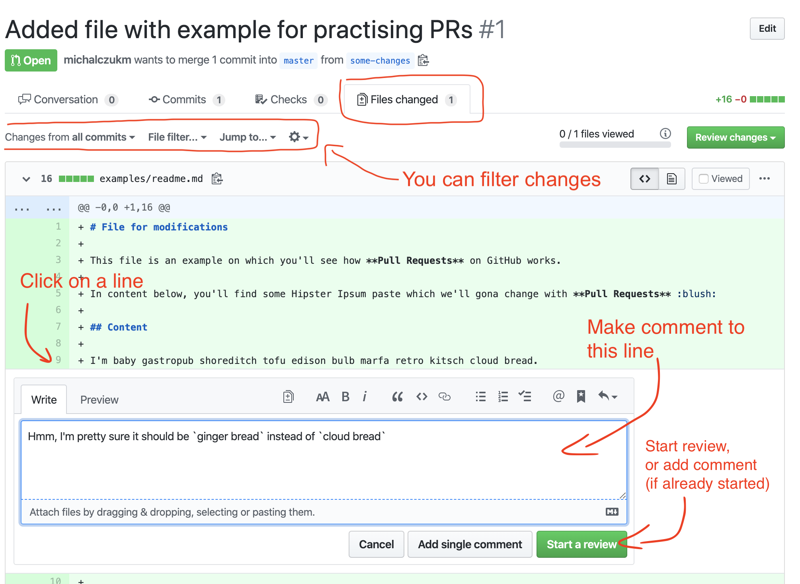
* Review changes/Finish review
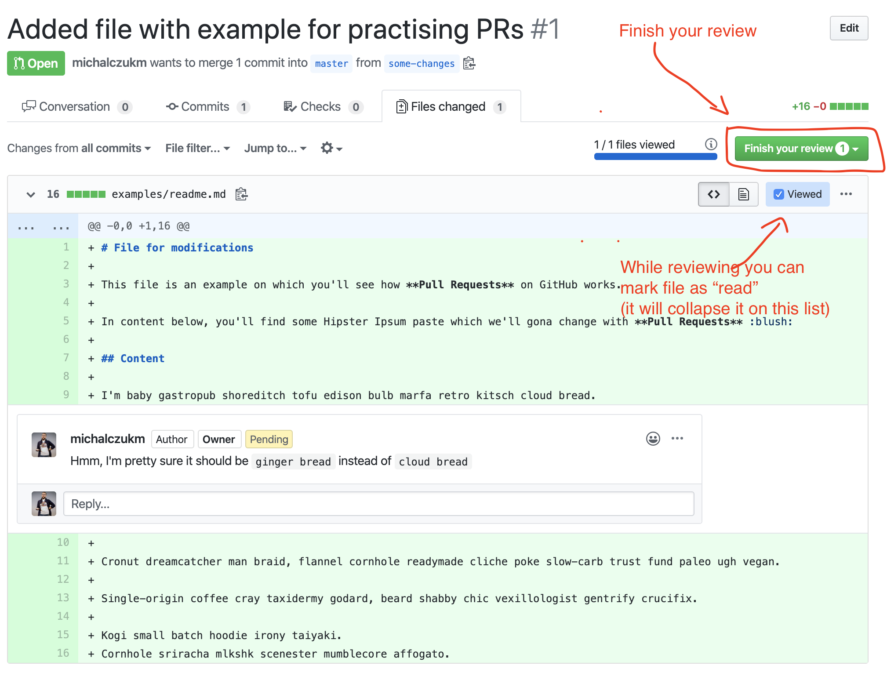
After that 👇
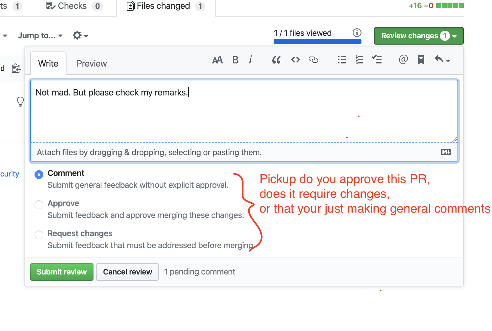

---

## Merging a Pull Request 👩‍💻👨‍💻

Once you and your collaborators are happy with the changes, you start to merge the changes back to master. There are a few ways to do this.

First, you can use github's "Merge pull request" button at the bottom of your pull request to merge your changes. This is only available when github can detect that there will be **no merge conflicts** with the base branch. If all goes well, you just have to add a commit message and click on "Confirm Merge" to merge the changes.

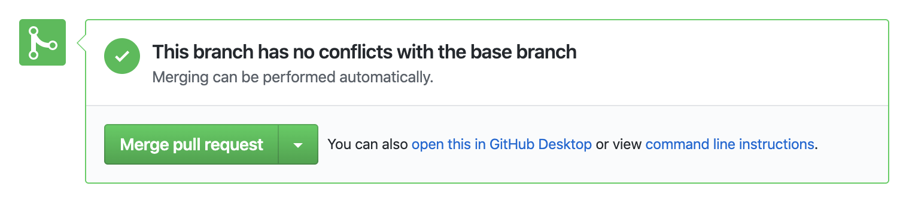

Then confirm it

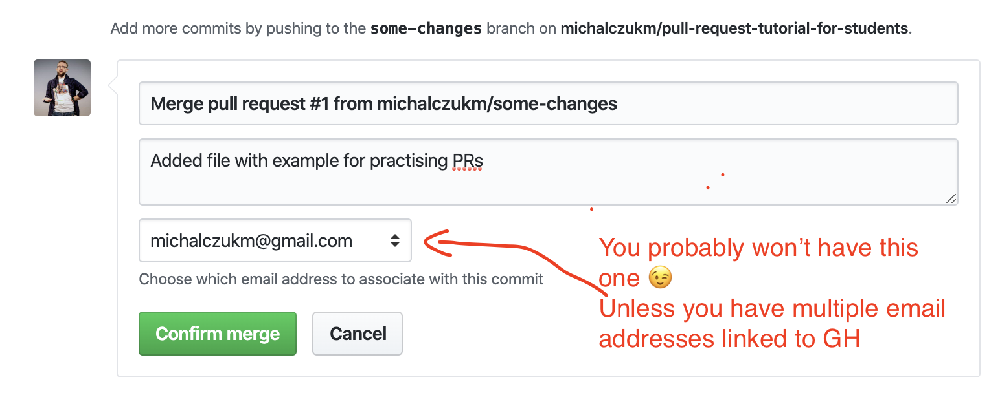

And done :clap: :clap: :clap:

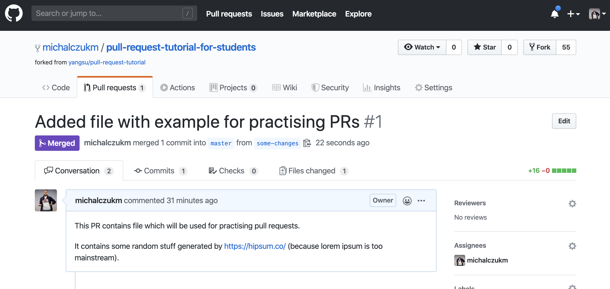

You can now remove your branch from GitHub. You probably won't gonna need it since all its changes got **merged** into `master`.


---

## Closing a Pull Request 👩‍💻👨‍💻/📖

You can always close PR.

#### Why?

* it was created by mistake
* it is totally not ready for review
* it is :suspect: and you don't want it in your repo
* ... whatever reason is good for closing it

:warning: If it is **your teammate** PR, you should probably contact with him/her and discuss that to avoid misunderstandings.

In general - be verbose, be good communicator, ask :blush:

#### How?
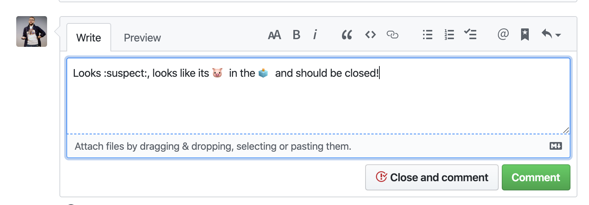

---

## More
<div style="border: 1px solid red">
<details>
    <summary> ⚠️ Danger zone, be careful - history rewrites down here ⚠️</summary>

I decided to create dedicated `danger zone` for this section and finally remove it, because I don't want to provide you **the simplest** (not uber-hight-crafter etc) way to work with Pull Requests.

Re-writing git history is not part of it IMHO.

Still - you can find this part in [original article](https://github.com/yangsu/pull-request-tutorial#squash-rebase-and-cherry-pick), since it was part of it.
</details>
</div>